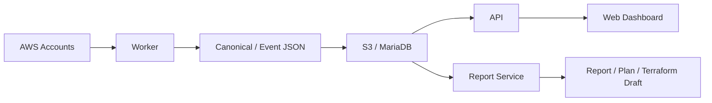

# DnDn-App

<div align="center">

### DnDn 서비스의 애플리케이션 모노레포

AWS 운영 이벤트를 **수집 → 정규화 → 분석 → 보고 → 실행안 초안화**하는  
DnDn 플랫폼의 핵심 애플리케이션 코드를 관리합니다.


</div>

---

## 소개

`DnDn-App`은 DnDn의 메인 서비스 코드를 담는 모노레포입니다.

이 저장소에는 아래 제품 기능이 함께 들어 있습니다.

- 운영 대시보드 및 문서 UI
- 인증, 조직, 문서, 워크스페이스, 연동 API
- AWS 변경 이력 수집 Worker
- 보고서 / 계획서 / Terraform 초안 생성 서비스
- 서비스 간 공유 스키마(`contracts`)

> 실제 Kubernetes 배포 선언, 환경별 GitOps 값, Argo CD 애플리케이션 정의는 이 레포가 아니라 [`DnDn-Infra`](https://github.com/ACS-DnDn/DnDn-Infra)에서 관리합니다.

---

## 이 레포가 담당하는 범위

### ✅ 이 레포가 하는 일

- 제품 기능 코드 관리
- 로컬 개발 / 테스트
- 서비스별 Docker 이미지 빌드
- GitHub Actions 기반 ECR 푸시
- 배포 대상 앱 이미지 태그 생산

### ❌ 이 레포가 하지 않는 일

- Terraform / CloudFormation 기반 인프라 생성
- Argo CD 애플리케이션 정의
- 환경별 Secret / Ingress / GitOps 소스 관리
- EKS 런타임 직접 운영

---

## 모노레포 구성

| 경로 | 역할 | 주요 기술 |
|---|---|---|
| `apps/web` | 운영 대시보드, 문서 뷰어, 워크스페이스 UI | React, TypeScript, Vite |
| `apps/api` | 인증, 문서, 워크스페이스, 연동 API | FastAPI, SQLAlchemy, MariaDB |
| `apps/worker` | AWS 데이터 수집 및 정규화 | Python, boto3, jsonschema |
| `apps/report` | 보고서 / 계획서 생성 API + SQS worker | FastAPI, Bedrock, S3, MariaDB |
| `contracts` | Worker / Report 공통 스키마와 샘플 | JSON Schema |
| `docs` | 운영 메모, 트러블슈팅 | Markdown |

---

## 서비스 흐름



---

## 빠른 시작

### 1) Web

```bash
cd apps/web
npm ci
npm run dev
```

- 기본 개발 주소: `http://localhost:3000`
- 프록시 기준:
  - `/api` → `http://localhost:8000`
  - `/report-api` → `http://localhost:8001`

### 2) API

`apps/api`는 import 경로가 `apps.api.src.*` 형식이므로 **레포 루트에서 실행**하는 편이 안전합니다.

```bash
python3 -m venv .venv
source .venv/bin/activate
pip install -r apps/api/requirements.txt
cp apps/api/.env.example apps/api/.env
set -a
source apps/api/.env
set +a
PYTHONPATH=. uvicorn apps.api.src.main:app --host 0.0.0.0 --port 8000 --reload
```

- Health check: `GET http://localhost:8000/health`
- 기본 prefix: `/api`

### 3) Report

```bash
cd apps/report
cp .env.example .env
uv sync
uv run uvicorn src.main:app --host 0.0.0.0 --port 8001 --reload
```

- Health check: `GET http://localhost:8001/health`
- 웹 연동 기준 포트: `8001`

> `uv`를 사용하지 않는다면 `pip install -e .` 후 `uvicorn src.main:app ...`으로도 실행할 수 있습니다.

### 4) Worker

```bash
python3 -m venv .venv
source .venv/bin/activate
pip install -e apps/worker
python apps/worker/tools/run_payload.py \
  --payload contracts/payload/weekly.payload.sample.json \
  --repo-root . \
  --out /tmp/dndn-out
```

---

## 로컬 연결 기준

| 서비스 | 포트 | 설명 |
|---|---:|---|
| Web | `3000` | 사용자 대시보드 / 문서 / 워크스페이스 |
| API | `8000` | 인증, 조직, 문서, 워크스페이스, 연동 API |
| Report | `8001` | 보고서 생성 / Terraform 초안 생성 |
| Worker | 파일 기반 / 워커 실행 | AWS 수집 및 정규화 엔진 |

---

## 핵심 기능 요약

### Web
- 대시보드
- 문서 목록 / 뷰어
- 워크스페이스
- 보고서 설정
- GitHub / Slack 콜백 처리

### API
- 인증
- 대시보드 데이터
- 문서 / 결재
- 조직 정보
- GitHub / Slack 연동
- 보고서 요청
- HR 연동 API
- 내부용 엔드포인트

### Worker
- `WEEKLY` / `EVENT` 실행 모드
- CloudTrail 수집
- AWS Config 상태 확인 및 before/after 보강
- AWS Health / Security Hub 계열 이벤트 보강
- `raw/`, `normalized/` 산출물 업로드

### Report
- 운영 보고서 생성
- 계획서 생성
- Terraform 초안 생성 / 검증 / 수정
- SQS 기반 비동기 처리
- S3 / MariaDB 저장

---

## 주요 라우트 / 엔드포인트

### Web 주요 화면
- `/login`
- `/dashboard`
- `/documents`
- `/viewer/:id`
- `/workspace`
- `/workspace/create`
- `/report-settings`
- `/pending`
- `/plan`
- `/mypage`
- `/auth/github/callback`
- `/auth/slack/callback`

### API 라우터
- `/api/auth`
- `/api/dashboard`
- `/api/documents`
- `/api/org`
- `/api/github`
- `/api/report-settings`
- `/api/reports`
- `/api/workspaces`
- `/api/hr/users`
- `/api/hr/departments`
- `/api/hr/company`
- `/api/admin/companies`
- `/api/slack`
- `/internal`

### Report 주요 엔드포인트
- `POST /api/report/event`
- `POST /api/report/health-event`
- `POST /api/report/weekly`
- `POST /api/report/render`
- `POST /report-api/documents/generate/plan`
- `POST /report-api/documents/generate/terraform`
- `GET /report-api/documents/generate/{job_id}`
- `POST /report-api/documents/generate/terraform/validate`
- `POST /report-api/documents/generate/terraform/fix`

---

## 환경변수 힌트

자주 보는 항목만 빠르게 정리하면 아래와 같습니다.

### API
- `SQLALCHEMY_DATABASE_URL`
- `AWS_REGION`
- `S3_BUCKET`
- `S3_PUBLIC_BUCKET`
- `COGNITO_USER_POOL_ID`
- `COGNITO_CLIENT_ID`
- `STS_ROLE_NAME`
- `STS_EXTERNAL_ID`
- `PLATFORM_ACCOUNT_ID`
- `CFN_TEMPLATE_URL`
- `EVENT_BUS_ARN`
- `SCHEDULER_GROUP_NAME`
- `SCHEDULER_ROLE_ARN`
- `SCHEDULER_TARGET_ARN`
- `REPORT_REQUEST_QUEUE_URL`
- `INTERNAL_API_KEY`

### Report
- `DATABASE_URL`
- `AWS_REGION`
- `BEDROCK_MODEL_ID`
- `S3_BUCKET`
- `GITHUB_TOKEN`
- `GITHUB_REPO`
- `SQS_QUEUE_URL`
- `POLL_INTERVAL`
- `DNDN_API_URL`
- `INTERNAL_API_KEY`
- `ALLOWED_ORIGINS`

---

## CI/CD

`main` 브랜치 push 또는 수동 `workflow_dispatch`로 앱별 빌드가 수행됩니다.

### 빌드 대상 이미지
- `dndn-prd-web`
- `dndn-prd-api`
- `dndn-prd-worker`
- `dndn-prd-report`

### 배포 흐름
1. 변경된 앱을 감지합니다.
2. API 변경이 있으면 단위 테스트를 수행합니다.
3. 대상 앱 이미지를 ECR에 push 합니다.
4. [`DnDn-Infra`](https://github.com/ACS-DnDn/DnDn-Infra)의 GitOps manifest 이미지 태그를 갱신합니다.
5. Argo CD가 변경을 감지해 rollout 합니다.

> 기본 ECR Registry: `387721658341.dkr.ecr.ap-northeast-2.amazonaws.com`

---

## 디렉터리 구조

```text
.
├── apps/
│   ├── api/
│   ├── report/
│   ├── web/
│   └── worker/
├── contracts/
├── docs/
└── .github/workflows/deploy-app.yml
```

---

## 문서 안내

- [`apps/web/README.md`](./apps/web/README.md)
- [`apps/api/README.md`](./apps/api/README.md)
- [`apps/report/README.md`](./apps/report/README.md)
- [`apps/worker/README.md`](./apps/worker/README.md)
- [`apps/worker/IAM_ONBOARDING.md`](./apps/worker/IAM_ONBOARDING.md)
- [`contracts/README.md`](./contracts/README.md)
- [`docs/TROUBLESHOOTING.md`](./docs/TROUBLESHOOTING.md)

---

## 관련 저장소

- [`ACS-DnDn/.github`](https://github.com/ACS-DnDn/.github) — 조직 프로필 / 공통 GitHub 설정
- [`ACS-DnDn/DnDn-Infra`](https://github.com/ACS-DnDn/DnDn-Infra) — Terraform / CloudFormation / GitOps / Runbook
- [`ACS-DnDn/DnDn-HR`](https://github.com/ACS-DnDn/DnDn-HR) — HR 포털 프론트엔드

---

## 추천 GitHub About 문구

> DnDn application monorepo for dashboard, API, AWS collectors, and AI-driven report services.

## 추천 Topics

`react` `vite` `fastapi` `python` `aws` `cloudtrail` `devops` `monorepo` `reporting` `terraform`
